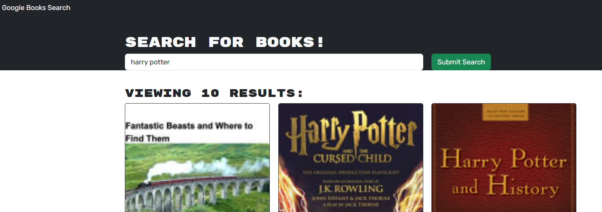

# BookSearchApp

## Description

The goal of this project was to convert an existing book search engine application and refactor it to use GraphQL API with an Apollo Server (originally RESTful API). The starter code is avaliable at the following repo:
https://github.com/coding-boot-camp/solid-broccoli

Heroku link: https://booksearchapplmb-a6178263c326.herokuapp.com/

## Installation

Please clone this repo to your local machine and npm i to install the packages in the package.json. Then, run 'npm run develop' to load the app on http://localhost:3000/

## Usage

Once you have the app loaded via localhost, simply input any book name into the search bar to load results. Screenshot below. 

## Credits

Columbia Coding Bootcamp

## License

MIT License

## How to Contribute

Follow the [Contributor Covenant](https://www.contributor-covenant.org/)!
